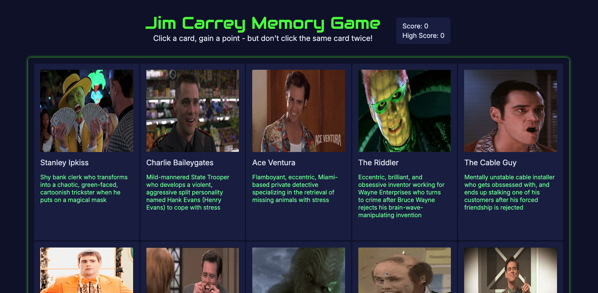
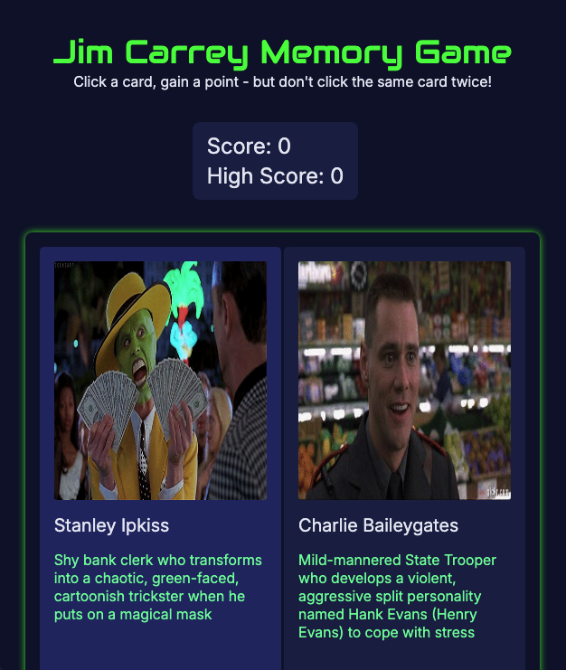
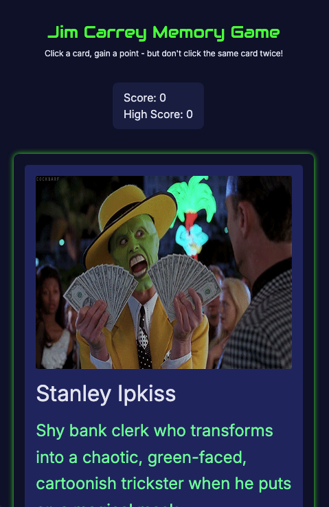

# 🧠🃏 Memory Card Game

Memory Card game built for The Odin Project curriculum.

## 👨‍💻 Technologies Used

- React
- Vite
- npm

## ✨ Features

- Jim Carrey
- API fetching employing useEffect React hook
- Card shuffling after user click
- Reponsive design for tablet and mobile viewing

## 👨‍🎓 What I Learned

- How to fetch from an API employing useEffect hook in tandem with useState
- Proper implementation of useRef hook in tandem with useState

## 🏃‍♂️ To Run

1. Clone Repo

```
git clone https://github.com/SamsDevLab/memory-card.git
cd memory-card
```

2.

```
npm install
```

3.

```
npm run dev
```

4. Open Vite Dev Server at [Local Host Server](http://localhost:5173/) in your browser

## Screenshots

Desktop View:



Tablet View:



Mobile View:


